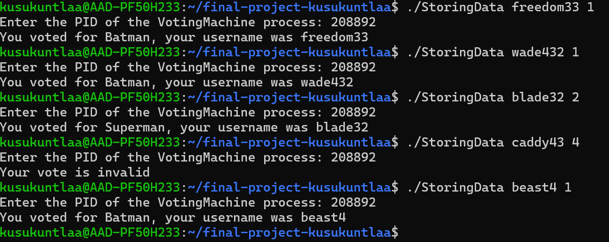

# final-project-kusukuntlaa
---
Purpose of the program:

In creating my Voting Machine, I decided to create a program that would collect votes if users like either Batman or Superman more (1 for Batman or 2 for Superman). I used the concept of signals in this Voting machine. I needed to implement 2 .c files which were VotingMachine.c and StoringData.c. In VotingMachine.c, I created the signal sigaction for handling any action with the user using integers. I also needed to collect the PID for VotingMachine for each compile. In the StoringData.c, I created the format on the votes that would be happening throughout the other multiple terminals such as entering the username and vote. I needed to use the sigqueue for communicating with the other terminal. The output with the votes would be happening in the terminal for VotingMachine.c such as the score and who the recent user voted for. The information for the email and their vote would be in TheUser.c and the score would be in TheBest.c.

* I made the format be |./StoringData username (1 or 2)| and then entering the PID of VotingMachine.c

* For the screenshot above, it shows the terminal is recieving the votes from other terminals and is able to display the score between both Batman and Superman in votes. It would give the user the PID to use in other terminals. It would also display who hit 5 votes first. 

* For the screenshot above, it shows the terminal is taking the usernames vote and is displaying their username afterwards and who they voted. The PID from VotingMachine.c would need to be entered in afterwards for it to communicate with the VotingMachine.c. If the user decided to not type 1 or 2 for their 3rd argument, they would recieve that their vote was invalid. The votes could be done through multiple different terminals. 

* For the screenshot above, it shows that the csv file for TheUser.csv file is being updated with displaying who the user voted for and their username. It would all be cleared once either side reaches 5 votes. 

* For the screenshot above, it shows that the csv file for TheBest.csv file is being updated with displaying the score in the votes after a user votes. It would be cleared once either side reached 5 votes. 

Overall, this program was able to communicate well using the signals sigqueue and sigaction. 